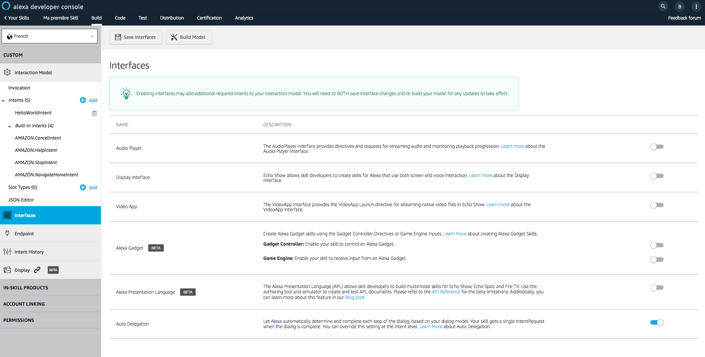
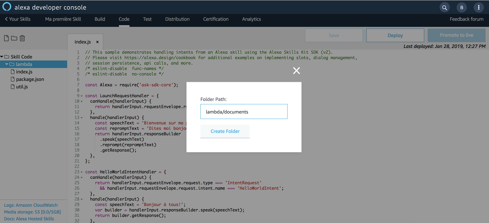
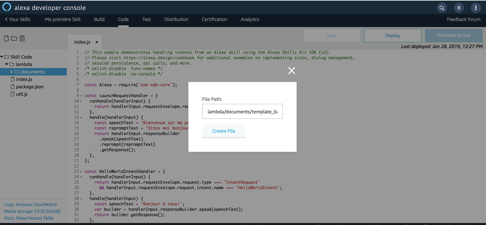
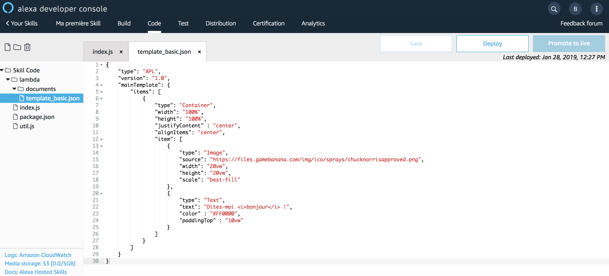

# Hello World APL Template

You will render your First Alexa Presentation Language (APL) Document using the [Alexa Node.js SDKv2](https://github.com/alexa/alexa-skills-kit-sdk-for-nodejs). The APL Document will be rendered for the following request type : ```LaunchRequest```.

1. Navigate to the [Alexa Developer Console](https://developer.amazon.com/alexa/console/ask) 


2. Click on your newly created Skill

3. On the `Build` Tab, click on the `Interfaces` link



4. Activate `Alexa Presentation Language` interface


5. Save the interfaces


> **Important:** Enabling interfaces may add additional required intents to your interaction model. You will need to BOTH save interface changes and re-build your model for any updates to take effect.

6. Navigate to the `Code` Tab of your Skill


7. Create a new Folder named `lambda/documents` 



8. Create a new File named [template_basic.json](../lambda/custom/documents/template_basic.json) in Folder ```lambda/documents``` and paste the document from the **APL Authoring Tool** into this file





> **Important:** Don't forget to save your file!

9. Open file ```index.js```

10. Create a new function to detect APL interface

```javascript
function supportsAPL(handlerInput) {
  const supportedInterfaces = handlerInput.requestEnvelope.context.System.device.supportedInterfaces;
  const aplInterface = supportedInterfaces['Alexa.Presentation.APL'];
  return aplInterface != null && aplInterface != undefined;
}
```

11. Locate the following Handler : ```LaunchRequestHandler```

12. Update the ```handle(handlerInput)```  method

**Before**

```javascript
  handle(handlerInput) {
    const speechText = 'Bienvenue sur ma première skill, vous pouvez me dire bonjour!';
    const repromptText = 'Dites moi bonjour!';
    return handlerInput.responseBuilder
      .speak(speechText)
      .reprompt(repromptText)
      .getResponse();
  }
```

**After**
```javascript
  handle(handlerInput) {
    const speechText = 'Bienvenue sur ma première skill, vous pouvez me dire bonjour!';
    const repromptText = 'Dites moi bonjour!';
    var builder = handlerInput.responseBuilder.speak(speechText).reprompt(repromptText);
    if (supportsAPL(handlerInput)) {
    builder.addDirective({
        type: 'Alexa.Presentation.APL.RenderDocument',
        version: '1.0',
        document: require('./documents/template_basic.json'),
        datasources: {}
    })
    }
    return builder.getResponse();
}
```

13. Save your code


>  **Important**: The developer console does not automatically save your work as you make changes. If you close the browser window without clicking Save, your work is lost.

14. Deploy your code


> **Important**: You must successfully deploy the code before you can test it.

15. Navigate to the `Test` tab of your Skill

10. Test your Skill


## Bravo ! You have just rendered your first APL Template.

#### Next Step : [Add a Datasource to your APL Template](./02-datasource.md)