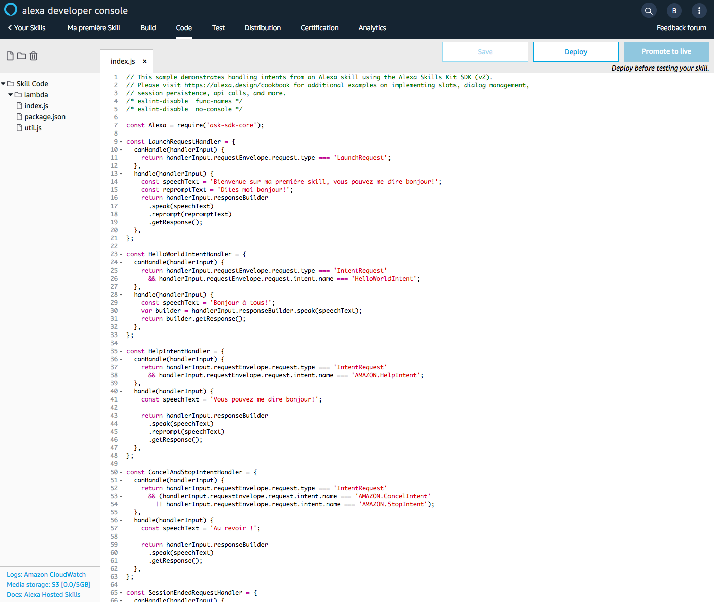

# Hello World APL Template (with Speech Transformer)

You will update your First Alexa Presentation Language (APL) Document to use [Speech Transformer](https://developer.amazon.com/docs/alexa-presentation-language/apl-data-source.html#ssmltospeech-transformer) from the **APL Authoring Tool**.
Then, you will render your Alexa Presentation Language (APL) Document using the [Alexa Node.js SDKv2](https://github.com/alexa/alexa-skills-kit-sdk-for-nodejs). The APL Document will be rendered for the following request type : ```LaunchRequest```.


1. Go back to the [APL Authorhing Tool](https://developer.amazon.com/alexa/console/ask/displays)

2. Select `Start from Scratch`


3. Slide the toggle from the Triple Pane Editor to the Single Pane View.

**Before**


**After**


4. Copy and Paste the code from this [link](../lambda/custom/documents/template_withspeechtransformer.json) overwriting the empty APL document in the window.

5. Click on `Data JSON`


6. Copy and Paste the code from this [link](../lambda/custom/datasources/datasource_withspeechtransformer.json) overwriting the empty Data JSON in the window. You should now see a simulation of the display render in the viewport window!


7. Switch the viewport from Medium Hub to Small Round Hub.


## Bravo ! You have just created your first APL Template using Speech Transformer. You will now use it in your Skill.

1. Navigate to the `Code` Tab of your Skill



2. Create a new File named [template_withspeechtransformer.json](../lambda/custom/documents/template_withspeechtransformer.json) in Folder ```lambda/documents``` and paste the `document` from the **APL Authoring Tool** into this file

3. Create a new File named [datasource_withspeechtransformer.json](../lambda/custom/datasources/datasource_withspeechtransformer.json) in Folder ```lambda/datasources``` and paste the `Data JSON` from the **APL Authoring Tool** into this file

4. Open file ```index.js```

5. Locate the following Handler : `LaunchRequestHandler`

6. Update the method ```handle(handlerInput)``` to have both ```Alexa.Presentation.APL.RenderDocument``` and ```Alexa.Presentation.APL.ExecuteCommands``` directives

**Before**

```javascript
...
  handle(handlerInput) {
    const speechText = 'Bienvenue sur ma première skill, vous pouvez me dire bonjour!';
    const repromptText = 'Dites moi bonjour!';
    var builder = handlerInput.responseBuilder.speak(speechText).reprompt(repromptText);
    if (supportsAPL(handlerInput)) {
        builder.addDirective({
            type: 'Alexa.Presentation.APL.RenderDocument',
            version: '1.0',
            document: require('./documents/template_withhinttransformer.json'),
            datasources: require('./datasources/datasource_withhinttransformer.json')
        })
    }
    return builder.getResponse();
}
...
```

**After**
```javascript
...
  handle(handlerInput) {
    const speechText = 'Bienvenue sur ma première skill, vous pouvez me dire bonjour!';
    const repromptText = 'Dites moi bonjour!';
    var builder = handlerInput.responseBuilder.speak(speechText).reprompt(repromptText);
    if (supportsAPL(handlerInput)) {
        builder.addDirective({
            type: 'Alexa.Presentation.APL.RenderDocument',
            version: '1.0',
            token: 'SpeechDocumentToken',
            document: require('./documents/template_withspeechtransformer.json'),
            datasources: require('./datasources/datasource_withspeechtransformer.json')
        })
        .addDirective({
            type: 'Alexa.Presentation.APL.ExecuteCommands',
            version: '1.0',
            token: 'SpeechDocumentToken',
            commands: [{
                "type": "SpeakItem",
                "componentId": "idVoiceDemoText",
                "highlightMode": "line"
            }]
        })
    }
    return builder.getResponse();
}
...
```

7. Save your code


>  **Important**: The developer console does not automatically save your work as you make changes. If you close the browser window without clicking Save, your work is lost.

8. Deploy your code


> **Important**: You must successfully deploy the code before you can test it.

9. Navigate to the `Test` tab of your Skill

10. Test your Skill


## Bravo ! You have just rendered your first APL Template with Alexa Speech Transformer.
